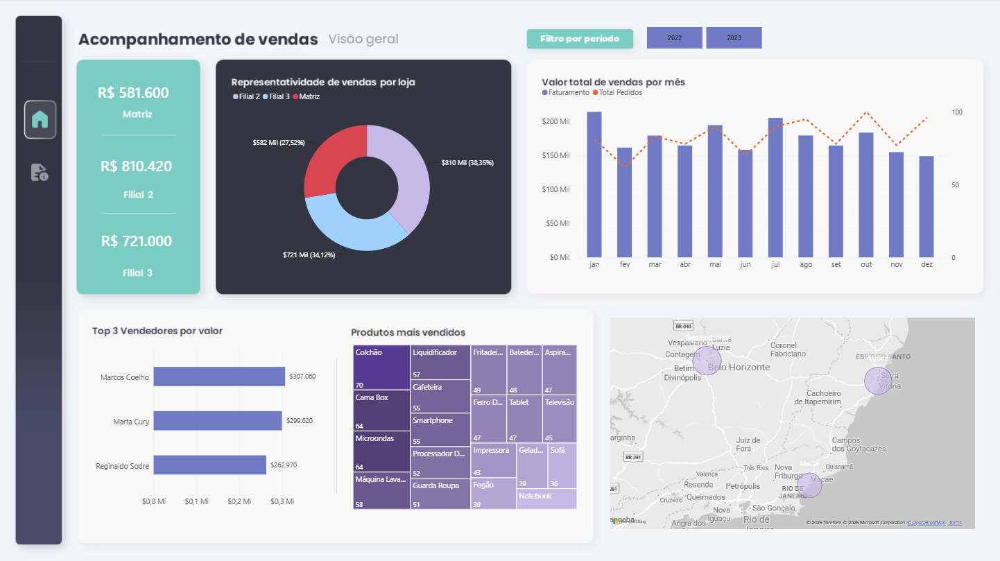
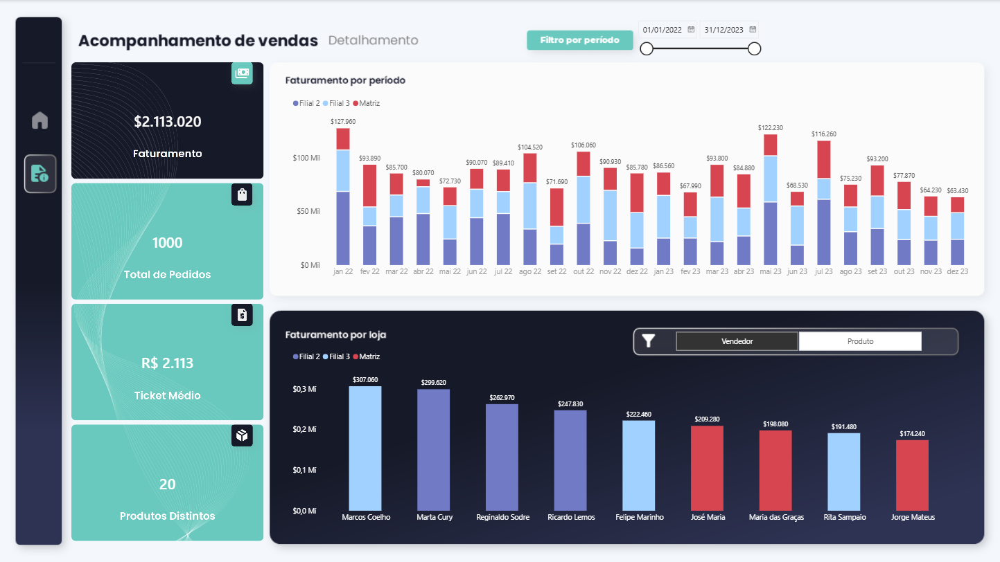

# 📊 Dashboard de Acompanhamento de Vendas

## 🎯 Objetivo

Projeto desenvolvido em Power BI com o objetivo de analisar o desempenho comercial e transformar dados de vendas em informações para acompanhamento dos principais indicadores da operação.

## 🛠️ Ferramentas utilizadas

* Power BI
* DAX
* Power Query
* Excel

## 📈 Principais indicadores

* Faturamento
* Quantidade de pedidos
* Ticket médio
* Produtos vendidos
* Desempenho por loja
* Desempenho por vendedor
* Evolução das vendas ao longo do tempo

## 🔎 Análises realizadas

O dashboard permite analisar o desempenho das vendas por diferentes perspectivas, incluindo período, loja, vendedor e produto.

A primeira página apresenta uma visão geral dos principais indicadores, enquanto a página de detalhamento permite aprofundar a análise dos resultados.

## 📊 Dashboard

### Visão Geral

### Detalhamento

## 📚 Objetivo do projeto

Este projeto faz parte do meu portfólio de Análise de Dados, com foco em Business Intelligence e Power BI.

O objetivo também foi aplicar conhecimentos de tratamento de dados, criação de indicadores, visualização e análise de informações para apoiar a tomada de decisão.
